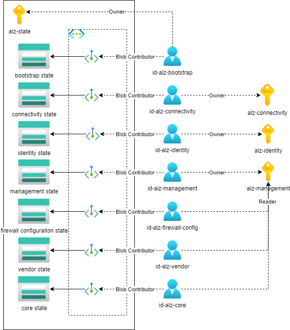

# ALZ.Bootstrap

This project is the starting point for deploying the Azure Landing Zones into a tenant.  Its main responsibility
is to create the service principals, service connections and storage accounts required to run the rest of the
projects.  Due to the fact that initially we have no storage account to store terraform state, the first action
is to create a storage account using Az Powershell.  Once this is created we continue the rest of the bootstrap
process using Terraform.

The following diagram shows the high level architecture of the bootstrap process:

# Pre-requisites

Before running the bootstrap for the first time, the following prerequisites are required:

1. Create an application registration called `id-alz-bootstrap` on the AAD tenant that the ALZ will be deployed to.
1. Create a new internal user in Azure AD and assign it the Global Administrator role.
1. Assign the subscription creator role to the `id-alz-bootstrap` service principal: [assign-the-subscription-creator-role-to-the-spn](https://learn.microsoft.com/en-gb/azure/cost-management-billing/manage/assign-roles-azure-service-principals#assign-the-subscription-creator-role-to-the-spn). Click on the 'Enrollment Account Role Assignments - Put' link in step 1. You will need to log in using the internal user created in step 3. Setup the Authenticator app for the local account if prompted.
1. Input the following details and select run:
    1. billingAccountName: <billing account id>
    1. billingRoleAssignmentName: <unique name>
    1. enrollmentAccountName: *<Billing Account ID>*
    1. api-version: 2019-10-01-preview
    1. body:
{
    "properties": {
      "principalId": "<*Enterprise Application Object ID*>",
      "principalTenantId": "<tenant id>",
      "roleDefinitionId": "/providers/Microsoft.Billing/billingAccounts/<billing account id>/departments/<*step 3 - enrollmentAccountName*>/billingRoleDefinitions/a0bcee42-bf30-4d1b-926a-48d21664ef71"
    }
  }

1. Assign the `Application Administrator` and `Privileged Role Administrator` roles to `id-alz-bootstrap` in AAD
1. Add SPN `id-alz-bootstrap` to the `Management Group Reader` role within the 'Tenant Root Group' Management Group. You might have to create a management group to access Access control (IAM) settings of the 'Tenant Root Group' Management Group.
1. Create a client secret for `id-alz-bootstrap`
1. Create service connection in Azure DevOps called `alz-state.id-alz-bootstrap.{Test or Prod}` using `id-alz-bootstrap` credentials.  The service connection should be scoped at the management group level (use the tenant id as the management group id and use the name 'Tenant root group')
1. Create a management group called `Default` and set it as the default management group

# Deploying

NOTE: If pipelines fail on Cache TFLint packages step (Run TFLint Checks job) then try running the `Run Checks` stage with the `Use Microsoft Hosted Agents` pipeline parameter selected first

1. Run the pipeline called `0.ALZ.Bootstrap`
1. Assign the newly created `id-az-core` and `id-az-vendor` to the `Owner` role on the `Default` management group
1. Run `1.ALZ.Management` with Use Microsoft Hosted Agents selected
1. Run `2.ALZ.FirewallConfiguration` with Use Microsoft Hosted Agents selected
1. Run `3.ALZ.Connectivity` with Use Microsoft Hosted Agents selected
1. Run `4.ALZ.Identity` with Use Microsoft Hosted Agents selected
1. Run `5.ALZ.Core` with Use Microsoft Hosted Agents selected
1. Grant subscription creator role on billing account to `id-alz-vendor` (see above ie id-alz-bootstrap)
1. Add a Policy waiver for the Policy `Public network access should be disabled for PaaS services`.  It should be scoped to the Hub MG and have a very short expiry (eg 3-4 hours).  It is only required for the next few steps
1. Run `6.ALZ.LandingZones.Platform` with Use Microsoft Hosted Agents selected
1. Run `ADO.AgentPools` with Use Microsoft Hosted Agents selected

At this point the bootstrap is complete.

1. Run `0.ALZ.Bootstrap` with Use Microsoft Hosted Agents NOT selected - This will deploy Private Endpoints to the storage accounts which contain Terraform state in alz-state
1. Run `1.ALZ.Management` with Use Microsoft Hosted Agents NOT selected
1. Run `2.ALZ.FirewallConfiguration` with Use Microsoft Hosted Agents NOT selected
1. Run `3.ALZ.Connectivity` with Use Microsoft Hosted Agents NOT selected
1. Run `4.ALZ.Identity` with Use Microsoft Hosted Agents NOT selected
1. Run `5.ALZ.Core` with Use Microsoft Hosted Agents NOT selected
1. Run `6.ALZ.LandingZones.Platform` with Use Microsoft Hosted Agents NOT selected
1. Run `6.ALZ.LandingZones.Apps` with Use Microsoft Hosted Agents NOT selected
1. Run `6.ALZ.LandingZones.Sandboxes` with Use Microsoft Hosted Agents NOT selected
1. Run `ADO.AgentPools` with Use Microsoft Hosted Agents NOT selected

## Inputs

| Name | Description | Type | Default | Required |
|------|-------------|------|---------|:--------:|
|  [billing\_scope](#input\_billing\_scope) | The billing scope for the subscriptions | `string` | n/a | yes |
|  [bootstrap\_mode](#input\_bootstrap\_mode) | Set to true to indicate that the bootstrap is in progress. This will cause storage accounts to be created without private endpoints. | `string` | n/a | yes |
|  [devops\_pat](#input\_devops\_pat) | The PAT for the Azure DevOps provider | `string` | n/a | yes |
|  [environment](#input\_environment) | The environment for the subscriptions | `string` | n/a | yes |
|  [existing\_connectivity\_subscription\_id](#input\_existing\_connectivity\_subscription\_id) | The subscription ID for the connectivity subscription | `string` | `""` | no |
|  [existing\_identity\_subscription\_id](#input\_existing\_identity\_subscription\_id) | The subscription ID for the identity subscription | `string` | `""` | no |
|  [existing\_management\_subscription\_id](#input\_existing\_management\_subscription\_id) | The subscription ID for the management subscription | `string` | `""` | no |
|  [primary\_location](#input\_primary\_location) | The primary location for the subscriptions | `string` | `"uksouth"` | no |
|  [tags](#input\_tags) | Set tags to apply to the resources | `map(string)` | <pre>{   "BusinessCriticality": "Mission-critical",   "BusinessUnit": "Platform Operations",   "DataClassification": "General",   "OperationsTeam": "Platform Operations",   "WorkloadName": "ALZ.Bootstrap" }</pre> | no |

## Outputs

| Name | Description |
|------|-------------|
|  [platform\_subscription](#output\_platform\_subscription) | n/a |
